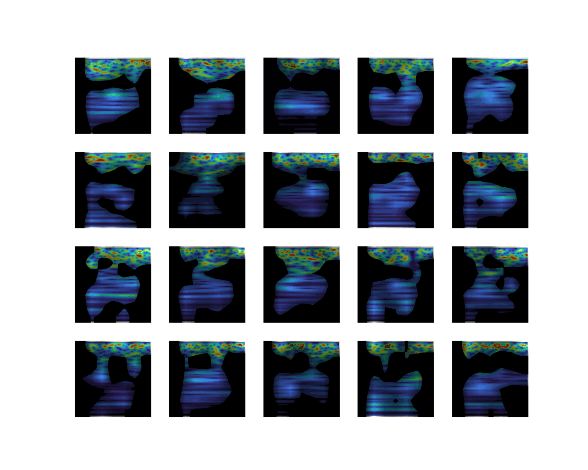
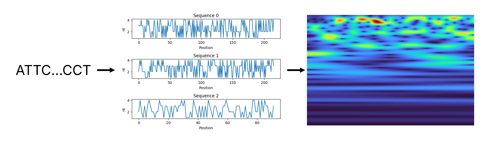
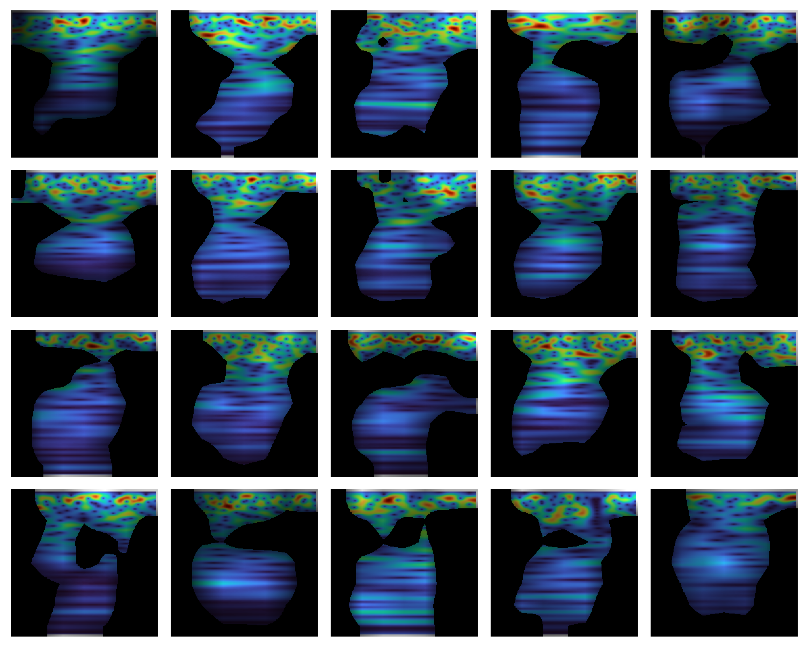
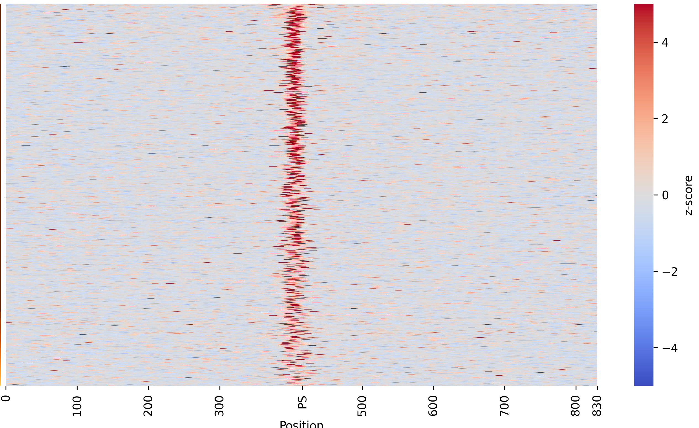

# &#x20;Transcription Factor Binding Site Detection using Wavelet Transforms


## Overview

This repository provides a pipeline for **Transcription Factor Binding Site (TFBS) detection** using **wavelet transforms** and deep learning. The pipeline was run on [CTCF ChIP-seq data](https://www.encodeproject.org/files/ENCFF796WRU/) obtained from ENCODE. The workflow includes:

- Extracting DNA sequences from **BED files**.
- Generating **wavelet colormaps** from sequences.
- Training a **ResNet** model to classify TFBS based on colormaps.
- Performing **explainability analysis** using Grad-CAM.
- Extracting **Position Weight Matrices (PWMs)** from high-activation regions (in progress).

## Repository Structure

```
.
├── examples
│   ├── subplots.ipynb
└── src
    └── dataset_split.py
    └── create_colormaps_TFBS_parallel.py
    └── train_resnet.py
    └── xai_grid_cam.py
    └── extract_pwm.py
requirements.txt
```

## Installation

To set up the environment, install the required dependencies:

```bash
pip install -r requirements.txt
```

## Usage

### 1. Split Dataset

Extract sequences from **positive/negative BED files** and create train/test FASTA:

```bash
python dataset_split.py path/to/positive_bed path/to/negative_bed path/to/genome.fa
```

### 2. Generate Wavelet Colormaps

Transform DNA sequences into colormap images using wavelet transforms:

```bash
python create_colormaps_TFBS_parallel.py /path/to/fastafile output_dir synchrosqueeze_flag prefix threshold num_workers
```
The script implements the following **pipeline**:



### 3. Train ResNet Model

Train a **ResNet** classifier on the generated colormaps:

```bash
python train_resnet.py
```

### 4. Explainability with Grad-CAM

Visualize **activation maps** from the ResNet model:

```bash
python xai_grid_cam.py input_dir output_dir gif_flag [max_sequences] [gif_output_dir]
```

Example of activation maps:



The activation maps for CNN layers resembles what found for the same TF (CTCF) using SVMs, focusing on the center of the sequences.
In such regions is where TF binds most frequently.




### 5. Extract Position Weight Matrices (PWM)

Generate PWM from highly activated sequence regions (in progress for now):

```bash
python extract_pwm.py path/to/images /path/to/fastafile output_dir [num_sequences]
```

### Extra: Images Visualization

`subplots.ipynb` contains some examples of TFBS visualization using colormaps.

## Results

- **Classification Metrics**: Accuracy, Precision, Recall, F1-score, AUROC and AUPRC logged using **Weights & Biases (wandb)**.
- **Explainability**: Heatmaps showing regions critical for TFBS detection.
- **PWM Extraction**: Identifying key motifs in binding sites.

## Acknowledgments

This project utilizes **ssqueezepy** for TFBS transformation in colormaps.

```
@article{OverLordGoldDragon2020ssqueezepy,
  title={ssqueezepy},
  author={John Muradeli},
  journal={GitHub. Note: https://github.com/OverLordGoldDragon/ssqueezepy/},
  year={2020},
  doi={10.5281/zenodo.5080508},
}
```

